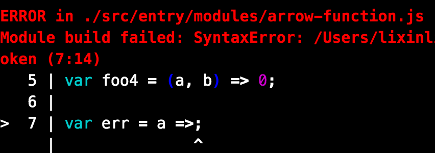
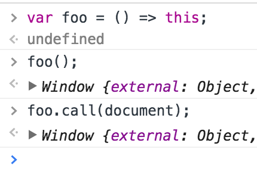

# ECMAScript6 - Advice
> [github地址](https://github.com/lixinliang/blog/tree/master/notebook/2016.04.28-es6-advice)


## 前言

相信大家都对es6已经有初步的认识与了解，这里就不重复介绍了。每个人都有自己的学习方式与方法，大家可以对感兴趣的内容自行搜索了解。

以前，我们还没有把es6加入到工作流之中，谈论使用，还为时过早。但现在，我们有了`generator-gw`，我们随时随地都可以作出新的尝试了。

#### 然而，大家可能心中还有一丝疑虑，使用es6就意味着不兼容。在ie7，ie8等浏览器，连es5的api都没有达到完全支持，又怎么使用es6呢？

#### 所以讨论一下：关于es6的使用建议。

顺便把一些容易掉坑的地方都踩一遍。

|语法|描述|IE7|
|-|-|-|
|let| |√|
|const| |√|
|destructuring|解构赋值|√|
|template-string|模板字符串|√|
|default|解构赋值与函数参数的默认值|√|
|rest| |√|
|spread|扩展运算符|√|
|arrow-function|箭头函数|√|
|object-literals|属性的简洁表示法|√|
|concise-methods|方法的简洁表示法|√|
|computed-property-names|属性名表达式|√|

# destructuring

`康熙谁来了`


`春日优惠礼包`


遇到过比较坑的一次是，使用了`var [...]`来解构对象，导致全部变量都解构失败。所以使用解构赋值时，先确认解构对象的`类型`，如果是解构对象，还要确认，变量名是否为解构对象的`键名`，如果是解构数组，则确认变量的顺序是`一一对应`。

# object-literals

`康熙谁来了`


当对象的属性与赋值的变量一致时，我们可以使用简洁表示法。

# arrow-function

`function`这个关键字不仅词频高，字符还长。而箭头函数就是为了解决这个问题，用更简洁的表示方式，表达我们的编程思路。

使用箭头函数时，我们可以把`=>`理解为一个操作符，比如下面这个例子`var a = a => a;`。当出现`=>`时，那么它的运算结果就是一个函数。而在`=>`的左边是这个函数的形参，而在`=>`的右边是这个函数的返回值。

#### 是不是这样理解就一目了然了呢？

那么，我们只需要关注`=>`的两侧。

在箭头的左侧，有以下表达方式：


#### 为了避免混淆，箭头函数的形参部分，必须使用()。

无论是箭头的左侧还是右侧，缺失的话，都会抛出错误。



而在箭头的右侧，情况就更多了，我们可以归类为三种情况，第一种是返回一个值，第二种是返回一个表达式，第三种是代码块。

我们先看只返回一个值的时候。这个值可以是任意类型。


这里一切都与我们的预期一样，除了有一点，就是`对象`。因为js里面，解析引擎无法识别`{}`是代码块还是对象。在箭头函数这里，只要遇到`{}`一律解析为代码块。

而且比较坑的是，当我们返回对象时，无论编译还是运行都会报错。但返回只有一个键对值的对象时，却不会提示错误。


那是因为，`a:0`这是一句符合规范的代码。[@see label syntax](https://developer.mozilla.org/en-US/docs/Web/JavaScript/Reference/Statements/label)

那么，正确的返回对象的箭头函数的写法应该如下：


使用`()`包起来。

还有返回箭头函数，用es6的新语法定义的对象等：


然后第二种情况是表达式：


箭头函数会将表达式的结果作为返回值。

但是遇到逗号操作符则不会。


所以优先级大概是0~3之间。

第三种情况是代码块。

````
var foo = () => {
    // some code
    return 0
};
````

以上是使用箭头函数，要注意的写书格式问题。
除此以外，还有要注意的关于用法上的地方：
1. this
2. arguments
3. new

在箭头函数内，没有`this`也没有`arguments`。




所以，什么情况下使用`function`什么情况下使用`=>`由开发者自行判断。

````
var foo = () => 0;

console.log(typeof foo); // function

new foo(); // Uncaught TypeError: foo is not a constructor

````

箭头函数的类型是函数但不能使用new关键字。

立即执行函数IIFE(Immediately-Invoked Function Expression)
````
((win) => {
    // some code
})(window);
````
